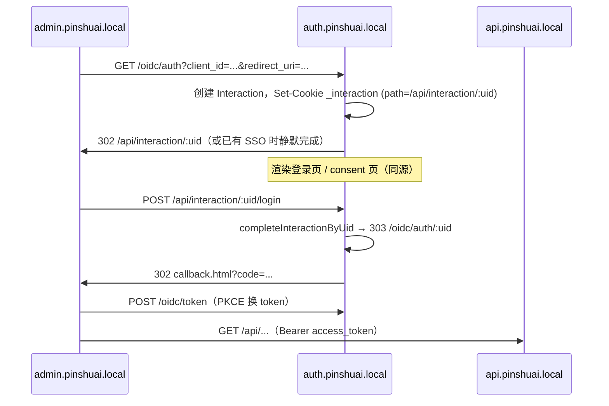

# SSO 授权服务器重构方案与改动记录

> 本文档记录 IAM Platform 从「异源登录页 + 共享 issuer」迁移到 **Google 式标准 SSO** 的架构决策、实现方案与代码改动清单。  
> 本地 Nginx 启动步骤见 [deploy/README.md](../deploy/README.md)。

---

## 1. 背景与问题

### 1.1 旧架构（已废弃）

| 组件 | 地址 | 说明 |
|------|------|------|
| IdP / issuer | `api.pinshuai.local/oidc` | 与业务 API 同域 |
| 登录页 | `login.pinshuai.local`（:4180 静态服务） | **异源**于 `/oidc` |
| interaction URL | `http://login.pinshuai.local/?uid=...` | pathname 塌缩为 `/` |

### 1.2 根因

`node-oidc-provider` 按 `interactions.url` 目标 URL 的 **pathname** 设置 `_interaction` cookie 的 path。

旧架构把登录页放到异源 `login.pinshuai.local/?uid=` → pathname 为 `/` → `_interaction` 在 IdP 主机上变成 **单例 cookie**（path=`/`）。多 client / 多 Tab 并发时互相覆盖，导致：

- iam-admin 登录读到 flow-admin 的 interaction
- `client_id` 串号、登录失败或跳错应用
- 曾用 `forceInteractionCookie` 等补丁绕过，但不是标准做法且不稳定

### 1.3 重构目标（对标 Google SSO）

- **专用授权服务器子域**：`auth.pinshuai.local`（对标 `accounts.google.com`）
- **多 client SaaS**：iam-admin、flow-admin 等独立 SPA
- **首次 consent**：业务 client 默认 `first_time`
- **iam-admin 免授权**：`never`（管理端不对自身弹确认页）
- **多 Tab SSO 续登**：一处登录，其它 Tab 自动续登
- **各应用独立登出**：业务本地退出 vs IdP 全局退出

---

## 2. 目标架构

### 2.1 子域拓扑（Nginx 本地模拟 / 生产同构）

```text
auth.pinshuai.local   → :3000   授权服务器（/oidc + /api/interaction + 登录/consent UI）
api.pinshuai.local    → :3000   IAM 业务 API（Bearer Token）
admin.pinshuai.local  → :8848   iam-admin SPA
flow.pinshuai.local   → :8849   flow-admin SPA
login.pinshuai.local  → 301     废弃，重定向到 auth
```

### 2.2 职责拆分

| 子域 | 职责 | Cookie |
|------|------|--------|
| `auth.*` | OIDC 协议、SSO Session、登录/consent UI | `_session`、`_interaction`（per-uid path） |
| `api.*` | 业务 REST API | 无 SSO cookie，仅 `Authorization: Bearer` |
| `admin.*` / `flow.*` | 各业务 SPA | 本应用 token / PKCE state（localStorage） |

### 2.3 核心设计原则

1. **登录 / consent 与 `/oidc` 同源**（均在 `auth.pinshuai.local`）
2. **interaction URL 使用 per-uid 路径**：`/api/interaction/:uid`
3. **`_interaction` cookie path 按 uid 隔离**，多 client 不串号
4. **URL 中的 `:uid` 为权威来源**：服务端按 uid 查库完成交互，不依赖浏览器 cookie 是否就绪
5. **SPA 配置拆分**：`oidcIssuer` → auth；`iamBaseUrl` → api

### 2.4 授权流程（简图）



### 2.5 Consent 策略

| client | consentMode | 行为 |
|--------|-------------|------|
| `iam-admin-spa` | `never` | 登录后自动建立 Grant，不展示授权确认页 |
| `flow-admin-spa` | `first_time` | 首次需用户确认 scope，之后复用 Grant |
| 其它（默认） | `first_time` | `DEFAULT_CONSENT_MODE` |

---

## 3. 环境与配置

### 3.1 `.env.nginx`（`NODE_ENV=nginx`）

```env
APP_URL=http://api.pinshuai.local
BETTER_AUTH_URL=http://api.pinshuai.local
OIDC_ISSUER=http://auth.pinshuai.local/oidc
```

已删除 `IAM_LOGIN_URL`（不再使用独立登录域）。

### 3.2 启动命令

```powershell
# 一键（推荐）
pnpm dev:nginx

# 或手动：IAM 必须用 nginx 环境
pnpm start:dev:nginx
```

启动日志应包含：

```text
OIDC issuer=http://auth.pinshuai.local/oidc（登录/consent UI 同源托管于 http://auth.pinshuai.local/api/interaction/:uid）
```

### 3.3 OAuth seed

```powershell
pnpm seed:oauth-iam-admin   # redirect_uri + consentMode=never
pnpm seed:oauth-flow-admin  # redirect_uri + consentMode=first_time
```

### 3.4 hosts

```text
127.0.0.1 auth.pinshuai.local
127.0.0.1 api.pinshuai.local
127.0.0.1 admin.pinshuai.local
127.0.0.1 flow.pinshuai.local
```

---

## 4. 改动记录

### 4.1 后端（IAM / NestJS）

| 文件 | 改动摘要 |
|------|----------|
| `apps/iam/src/modules/security/oidc/services/oidc.service.ts` | `interactions.url` → `${issuerOrigin}/api/interaction/${uid}`；`cookies.long/short` 设 `sameSite: 'lax'`；新增 `completeInteractionByUid()` 按 URL uid 结束 interaction；`finishLogin` / `finishConsent` 改为接收 `uid` 参数 |
| `apps/iam/src/modules/identity/auth/interaction/interaction.controller.ts` | 重写为同源渲染登录/consent；`GET /api/interaction/:uid` 注入 `window.__INTERACTION__`；`resolveDetails` 按 uid 查库；删除 `forceInteractionCookie`、跨域补丁等；保留 `sso/status`、login/consent POST |
| `apps/iam/src/main.ts` | 挂载 `/interaction-assets` 静态资源；CORS 加入 `auth.pinshuai.local`，移除 `login.pinshuai.local` |
| `libs/contracts/src/security/oidc.contract.ts` | `finishLogin` / `finishConsent` 契约增加 `uid` 参数 |
| `apps/iam/src/database/seeds/oauth-iam-admin.ts` | `consentMode: never`，合并 nginx redirect_uri |
| `apps/iam/src/database/seeds/oauth-flow-admin.ts` | `consentMode: first_time`，合并 nginx redirect_uri |
| `.env.nginx` | `OIDC_ISSUER=http://auth.pinshuai.local/oidc` |
| `.env.development` | 删除 `IAM_LOGIN_URL` |

### 4.2 登录 / Consent UI

| 文件 | 改动摘要 |
|------|----------|
| `apps/iam-login/assets/index.js` | 读 `window.__INTERACTION__`；同源 POST `/api/interaction/:uid/login`；`sso/status` 轮询跨 Tab 续登 |
| `apps/iam-login/assets/consent.js` | 简化，bootstrap + 相对路径 |
| `apps/iam-login/assets/sso-sync.js` | **删除** |
| `apps/iam-login/index.html` / `consent.html` | 移除 `config.js`、`sso-sync.js` 引用 |

> 注：`apps/iam-login/server.js`、`config.js` 仍保留但 **nginx 模式不再使用**（:4180 已下线）。

### 4.3 SPA 客户端

| 文件 | 改动摘要 |
|------|----------|
| `apps/iam-admin/public/config.js` | nginx 模式：`oidcIssuer` → auth，`iamBaseUrl` → api |
| `apps/iam-admin/src/utils/oidc.ts` | 同上；`beginSsoRedirect` 顶层跳 `/oidc/auth`，不再跨源探测 `sso/status` |
| `apps/iam-admin/src/views/login/useSsoLoginPage.ts` | 配合新 SSO 入口 |
| `flow-admin/frontend/public/config.js` | 同上（flow-admin） |
| `flow-admin/frontend/src/utils/oidc.ts` | 同上 |
| `flow-admin/frontend/src/views/login/useSsoLoginPage.ts` | 同上 |

### 4.4 基础设施

| 文件 | 改动摘要 |
|------|----------|
| `deploy/nginx/conf.d/iam.conf` | 新增 `auth.pinshuai.local`；`login` 301 → auth；`resolver ipv6=off` + 变量 `proxy_pass` 修复 Windows Docker IPv6 502 |
| `dev-infra/nginx/conf.d/iam.conf` | 与 deploy 配置同步 |
| `deploy/docker-compose.nginx.yaml` | Nginx 网关（挂载 conf.d） |
| `run-nginx.js` | 不再起 `:4180` iam-login；提示代理绕过；注入 `NO_PROXY` |
| `deploy/README.md` | 更新启动说明、故障排查（含 Clash 代理、cookie 清理） |

---

## 5. 关键实现说明

### 5.1 为何 URL uid 优先于 cookie？

`/oidc/auth` 302 到 `/api/interaction/:uid` 时，浏览器可能尚未带上 per-path 的 `_interaction` cookie。若仍调用 `provider.interactionDetails()`（强依赖 cookie），会报 `interaction session not found` → **400 会话已失效**。

**现行做法**：

- `resolveDetails`：`findInteractionByUid(uid)` 直接查库
- `finishLogin` / `finishConsent`：`completeInteractionByUid(uid, ...)` 写回 result 并 303 到 `returnTo`
- 响应中 `Set-Cookie` 补上 per-uid `_interaction`，便于后续 `/oidc/auth/:uid` resume

### 5.2 SSO 行为矩阵

| 场景 | 行为 |
|------|------|
| 未登录访问 SPA | 跳 `auth/oidc/auth` → 登录页 |
| 已有 IdP 会话 | 静默完成 login interaction → 回跳 code |
| iam-admin 二次进入 | consent `never` → 直接进入 |
| flow-admin 首次 | consent `first_time` → 授权确认页 |
| 多 Tab 停在登录页 | `sso/status` 探测到会话 → `restartAuthUrl` 续登 |
| 业务本地登出 | 吊销 access_token，保留 IdP Session |
| 全局登出 | RP-Initiated Logout → `session/end` |

### 5.3 已删除的补丁（勿恢复）

- `forceInteractionCookie` / `pinInteractionToUid` 全环境强制覆写
- `login.pinshuai.local` 异源登录
- `sso-sync.js` 跨源 referrer 推断 client_id
- 跨源 `sso/status` 探测（SameSite=Lax 跨源不可靠）

---

## 6. 本地验证清单

- [ ] hosts 含 `auth.pinshuai.local`
- [ ] Clash / 代理绕过 `*.pinshuai.local`（否则 502）
- [ ] `docker compose -f deploy/docker-compose.nginx.yaml up -d`
- [ ] `pnpm dev:nginx`，日志 issuer 为 `auth.pinshuai.local`
- [ ] 已执行 oauth seed
- [ ] 浏览器已清除 `*.pinshuai.local` 旧 cookie
- [ ] http://admin.pinshuai.local 未登录 → 跳转 auth 登录页
- [ ] 登录成功 → 回 admin 首页
- [ ] 开 flow 验证 SSO / 首次 consent
- [ ] 多 Tab 续登、独立登出

---

## 7. 故障排查速查

| 现象 | 常见原因 |
|------|----------|
| `localhost` 正常，`*.pinshuai.local` 502 | 本机代理未绕过 `*.pinshuai.local` |
| `GET /api/interaction/:uid` 400 | interaction 已过期；或 IAM 未用 `start:dev:nginx`；清 cookie 重登 |
| issuer 指向 localhost | 未用 `NODE_ENV=nginx` 启动 |
| client_id 串号 | 旧 cookie（path=`/`）残留 → 清 `*.pinshuai.local` cookie |

详见 [deploy/README.md §7 故障排查](../deploy/README.md#7-故障排查)。

---

## 8. 与旧文档的关系

- `doc/nginx-部署.md` 中 `login.pinshuai.com` 拓扑已过时，以本文 **auth 子域** 模型为准。
- 生产部署时将 `auth.pinshuai.local` 换为正式域名（如 `auth.pinshuai.com`），原则不变。

---

## 9. 变更时间线（摘要）

| 阶段 | 内容 |
|------|------|
| 问题定位 | `_interaction` cookie path=`/` 导致多 client 串号 |
| 架构决策 | 专用 `auth` 子域 + 同源 per-uid interaction |
| 后端重构 | InteractionController 同源渲染；oidc.service interactions.url / cookie |
| SPA / Nginx | issuer 指向 auth；nginx auth 块；废弃 login 域 |
| 稳定性修复 | `completeInteractionByUid` 解决 400；nginx `ipv6=off`；代理绕过文档 |

---

*文档版本：2026-07-10 · 对应代码库 iam-platform SSO 授权服务器重构完成态*
