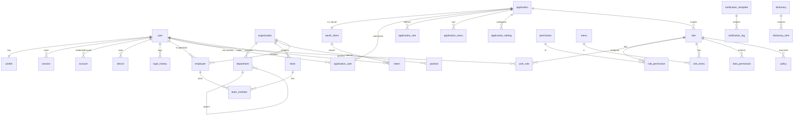

# IAM Platform · 数据库库表设计

> 数据库：**MySQL 8.4**（`utf8mb4` / `utf8mb4_0900_ai_ci`，InnoDB）
> ORM：**TypeORM + mysql2**，`synchronize=false`，全部走 migration。
> 命名：表名/列名 `snake_case`；实体 camelCase（`SnakeNamingStrategy`）。

## 通用约定

- **主键 `id`**：`char(26)`（ULID，有序、分布式唯一）。
- **审计字段**（BaseEntity 统一注入）：`created_at datetime(3)`、`updated_at datetime(3)`、`deleted_at datetime(3) null`（软删除）。下表中不再逐行重复列出。
- **外键**：逻辑外键为主（应用层维护），关键约束（如 `oauth_client.application_id`）加物理外键。所有关联列建索引。
- **金额/枚举**：枚举用 `varchar` + 应用层常量或 `enum`；布尔用 `tinyint(1)`。
- **多租户**：预留 `organization_id`（租户 = 顶层 organization）。当前单租户可空，未来平滑升级。

> 图例：🔑 主键　🔗 外键/关联　⭐ 唯一索引　🔎 普通索引

---

# 一、Identity 域（对齐 better-auth schema）

> better-auth 核心表为 `user / session / account / verification`。这里保持字段兼容，业务扩展字段放 `profile`，不污染认证表。

## 1. user 用户（身份核心）

| 列 | 类型 | 约束 | 说明 |
| --- | --- | --- | --- |
| id 🔑 | char(26) | PK | ULID |
| email | varchar(255) | ⭐ null | 登录邮箱 |
| email_verified | tinyint(1) | default 0 | 邮箱已验证 |
| phone | varchar(32) | ⭐ null | 手机号 |
| phone_verified | tinyint(1) | default 0 | 手机已验证 |
| name | varchar(100) | null | better-auth 需要的展示名（最小） |
| status | varchar(20) | 🔎 default 'active' | active / disabled / locked / pending |
| is_system | tinyint(1) | default 0 | 内置系统账号（如 admin），禁止删除 |
| last_login_at | datetime(3) | null | 最近登录时间 |

> 注意：密码 hash 不放 user，而放 `account`（`provider_id='credential'` 的 password 字段），与 better-auth 一致。这样社交/联邦登录用户可以没有密码。

## 2. profile 用户业务资料

| 列 | 类型 | 约束 | 说明 |
| --- | --- | --- | --- |
| id 🔑 | char(26) | PK | |
| user_id 🔗 | char(26) | ⭐ FK→user.id | 一对一 |
| nickname | varchar(100) | null | 昵称 |
| avatar | varchar(500) | null | 头像 URL（storage 域返回） |
| gender | varchar(10) | null | male/female/unknown |
| birthday | date | null | |
| language | varchar(10) | default 'zh-CN' | |
| timezone | varchar(64) | default 'Asia/Shanghai' | |
| bio | varchar(500) | null | 简介 |

## 3. session 门户登录态（better-auth session）

| 列 | 类型 | 约束 | 说明 |
| --- | --- | --- | --- |
| id 🔑 | char(26) | PK | |
| user_id 🔗 | char(26) | 🔎 FK→user.id | |
| token | varchar(255) | ⭐ | session token |
| expires_at | datetime(3) | 🔎 | 过期时间 |
| ip_address | varchar(64) | null | |
| user_agent | varchar(500) | null | |
| device_id 🔗 | char(26) | null FK→device.id | 关联设备 |

> 语义澄清（架构边界 #3）：`session` = 门户（auth.example.com）登录态；`security/token` = 下游系统拿到的协议令牌，二者不同。

## 4. account 账号来源（凭证 + 第三方/联邦）

| 列 | 类型 | 约束 | 说明 |
| --- | --- | --- | --- |
| id 🔑 | char(26) | PK | |
| user_id 🔗 | char(26) | 🔎 FK→user.id | 一个 user 可多个 account |
| provider_id | varchar(50) | | credential / github / google / wechat / feishu / ldap … |
| account_id | varchar(255) | | 该 provider 下的用户标识 |
| password | varchar(255) | null | provider=credential 时的 hash |
| access_token | text | null | 第三方 access token |
| refresh_token | text | null | |
| id_token | text | null | OIDC id_token |
| access_token_expires_at | datetime(3) | null | |
| scope | varchar(500) | null | |

- ⭐ 唯一：`(provider_id, account_id)`
- 联邦登录（微信/飞书，架构边界 #4）无需新域，仅在此表新增 provider 策略。

## 5. verification 验证 / Magic Link

| 列 | 类型 | 约束 | 说明 |
| --- | --- | --- | --- |
| id 🔑 | char(26) | PK | |
| identifier | varchar(255) | 🔎 | email / phone / 用途标识 |
| value | varchar(255) | | 验证码 / token |
| type | varchar(30) | | email_verify / phone_otp / magic_link / password_reset |
| expires_at | datetime(3) | 🔎 | |
| consumed_at | datetime(3) | null | 已使用时间 |

## 6. device 登录设备

| 列 | 类型 | 约束 | 说明 |
| --- | --- | --- | --- |
| id 🔑 | char(26) | PK | |
| user_id 🔗 | char(26) | 🔎 FK→user.id | |
| device_name | varchar(100) | null | Chrome on Windows |
| device_type | varchar(20) | null | desktop/mobile/tablet |
| os | varchar(50) | null | |
| browser | varchar(50) | null | |
| fingerprint | varchar(128) | 🔎 null | 设备指纹 |
| trusted | tinyint(1) | default 0 | 可信设备（Remember Me） |
| last_active_at | datetime(3) | null | |

## 7. login_history 登录审计

| 列 | 类型 | 约束 | 说明 |
| --- | --- | --- | --- |
| id 🔑 | char(26) | PK | |
| user_id 🔗 | char(26) | 🔎 null FK→user.id | 失败时可能无 user |
| identifier | varchar(255) | null | 尝试登录的账号 |
| ip | varchar(64) | 🔎 null | |
| user_agent | varchar(500) | null | |
| region | varchar(100) | null | IP 归属地 |
| success | tinyint(1) | 🔎 | 成功/失败 |
| fail_reason | varchar(100) | null | 密码错误 / 锁定 / MFA 失败 |
| login_type | varchar(30) | null | password / oauth / magic_link |

---

# 二、Organization 域

## 8. organization 组织 / 租户

| 列 | 类型 | 约束 | 说明 |
| --- | --- | --- | --- |
| id 🔑 | char(26) | PK | |
| parent_id 🔗 | char(26) | 🔎 null FK→self | 支持组织层级（集团-子公司） |
| name | varchar(200) | | |
| code | varchar(50) | ⭐ | 组织编码 |
| type | varchar(20) | default 'company' | tenant / company / branch |
| status | varchar(20) | default 'active' | |
| sort | int | default 0 | |

## 9. department 部门（树）

| 列 | 类型 | 约束 | 说明 |
| --- | --- | --- | --- |
| id 🔑 | char(26) | PK | |
| organization_id 🔗 | char(26) | 🔎 FK→organization.id | |
| parent_id 🔗 | char(26) | 🔎 null FK→self | 树结构 |
| name | varchar(200) | | 研发/产品/市场… |
| code | varchar(50) | 🔎 | |
| path | varchar(500) | 🔎 null | 物化路径 `/root/dev/`，加速子树查询 |
| leader_employee_id 🔗 | char(26) | null | 部门负责人 |
| sort | int | default 0 | |

- ⭐ 唯一：`(organization_id, code)`

## 10. team 团队

| 列 | 类型 | 约束 | 说明 |
| --- | --- | --- | --- |
| id 🔑 | char(26) | PK | |
| organization_id 🔗 | char(26) | 🔎 FK→organization.id | |
| name | varchar(200) | | AI Team / Platform Team |
| code | varchar(50) | 🔎 | |
| description | varchar(500) | null | |

## 11. position 岗位

| 列 | 类型 | 约束 | 说明 |
| --- | --- | --- | --- |
| id 🔑 | char(26) | PK | |
| organization_id 🔗 | char(26) | 🔎 FK→organization.id | |
| name | varchar(100) | | 经理/Leader/开发/测试 |
| code | varchar(50) | 🔎 | |
| level | int | default 0 | 职级 |

## 12. employee 员工（User ↔ 组织关系）

> User ≠ Employee：GitHub 登录者是 User 但不一定是 Employee。

| 列 | 类型 | 约束 | 说明 |
| --- | --- | --- | --- |
| id 🔑 | char(26) | PK | |
| user_id 🔗 | char(26) | 🔎 FK→user.id | |
| organization_id 🔗 | char(26) | 🔎 FK→organization.id | |
| department_id 🔗 | char(26) | 🔎 null FK→department.id | 主部门 |
| position_id 🔗 | char(26) | 🔎 null FK→position.id | |
| employee_no | varchar(50) | ⭐ null | 工号 |
| status | varchar(20) | default 'active' | active/resigned/probation |
| hired_at | date | null | 入职日期 |

- ⭐ 唯一：`(organization_id, user_id)`

## 13. team_member 团队成员（多对多）

| 列 | 类型 | 约束 | 说明 |
| --- | --- | --- | --- |
| id 🔑 | char(26) | PK | |
| team_id 🔗 | char(26) | 🔎 FK→team.id | |
| employee_id 🔗 | char(26) | 🔎 FK→employee.id | |
| role_in_team | varchar(50) | null | owner/member |

- ⭐ 唯一：`(team_id, employee_id)`

---

# 三、Application 域

## 14. application 应用

| 列 | 类型 | 约束 | 说明 |
| --- | --- | --- | --- |
| id 🔑 | char(26) | PK | |
| name | varchar(100) | | Admin / Workflow / AutoVE |
| code | varchar(50) | ⭐ | 应用唯一编码 |
| type | varchar(20) | default 'web' | web/spa/service/native |
| status | varchar(20) | default 'active' | |
| description | varchar(500) | null | |

> 权威业务元数据来源。`client_secret` 等敏感信息不在此表（见 oauth_client）。

## 15. application_user 应用授权用户

| 列 | 类型 | 约束 | 说明 |
| --- | --- | --- | --- |
| id 🔑 | char(26) | PK | |
| application_id 🔗 | char(26) | 🔎 FK→application.id | |
| user_id 🔗 | char(26) | 🔎 FK→user.id | |
| status | varchar(20) | default 'active' | 是否允许登录该应用 |
| granted_at | datetime(3) | null | |

- ⭐ 唯一：`(application_id, user_id)`

## 16. application_role 应用内角色

| 列 | 类型 | 约束 | 说明 |
| --- | --- | --- | --- |
| id 🔑 | char(26) | PK | |
| application_id 🔗 | char(26) | 🔎 FK→application.id | |
| name | varchar(100) | | 管理员/审批人/员工 |
| code | varchar(50) | | |

- ⭐ 唯一：`(application_id, code)`
> 与 Access 域 `role` 的关系：`application_role` 是「某应用下角色」的视图入口，实际权限绑定复用 Access 域的 `role/role_permission`（`role.application_id` 指向应用）。二者可合并落到 `role` 表 + `application_id`；此处保留独立表以支持应用侧自治管理。

## 17. application_menu 应用菜单

| 列 | 类型 | 约束 | 说明 |
| --- | --- | --- | --- |
| id 🔑 | char(26) | PK | |
| application_id 🔗 | char(26) | 🔎 FK→application.id | |
| parent_id 🔗 | char(26) | 🔎 null FK→self | |
| name | varchar(100) | | 审批/流程/报表 |
| path | varchar(200) | null | 前端路由 |
| icon | varchar(100) | null | |
| sort | int | default 0 | |

## 18. application_setting 应用配置

| 列 | 类型 | 约束 | 说明 |
| --- | --- | --- | --- |
| id 🔑 | char(26) | PK | |
| application_id 🔗 | char(26) | 🔎 FK→application.id | |
| config_key | varchar(100) | | logo/theme/login/webhook/callback |
| config_value | text | null | 值（JSON 或标量） |

- ⭐ 唯一：`(application_id, config_key)`

---

# 四、Access 域（RBAC + ABAC）

## 19. role 角色

| 列 | 类型 | 约束 | 说明 |
| --- | --- | --- | --- |
| id 🔑 | char(26) | PK | |
| application_id 🔗 | char(26) | 🔎 null FK→application.id | null=平台级角色 |
| name | varchar(100) | | 管理员/普通员工/审批人 |
| code | varchar(50) | | |
| type | varchar(20) | default 'custom' | system/custom |
| description | varchar(500) | null | |

- ⭐ 唯一：`(application_id, code)`

## 20. permission 权限点

| 列 | 类型 | 约束 | 说明 |
| --- | --- | --- | --- |
| id 🔑 | char(26) | PK | |
| application_id 🔗 | char(26) | 🔎 null FK→application.id | |
| name | varchar(100) | | 创建任务 |
| code | varchar(100) | | `task:create` |
| resource | varchar(50) | 🔎 | task/order/user |
| action | varchar(50) | | create/read/update/delete |

- ⭐ 唯一：`(application_id, code)`

## 21. role_permission 角色-权限（多对多）

| 列 | 类型 | 约束 | 说明 |
| --- | --- | --- | --- |
| id 🔑 | char(26) | PK | |
| role_id 🔗 | char(26) | 🔎 FK→role.id | |
| permission_id 🔗 | char(26) | 🔎 FK→permission.id | |

- ⭐ 唯一：`(role_id, permission_id)`

## 22. user_role 用户-角色（多对多）

| 列 | 类型 | 约束 | 说明 |
| --- | --- | --- | --- |
| id 🔑 | char(26) | PK | |
| user_id 🔗 | char(26) | 🔎 FK→user.id | |
| role_id 🔗 | char(26) | 🔎 FK→role.id | |
| application_id 🔗 | char(26) | 🔎 null FK→application.id | 授权作用域 |

- ⭐ 唯一：`(user_id, role_id, application_id)`

## 23. menu 后台菜单

| 列 | 类型 | 约束 | 说明 |
| --- | --- | --- | --- |
| id 🔑 | char(26) | PK | |
| parent_id 🔗 | char(26) | 🔎 null FK→self | |
| name | varchar(100) | | 后台菜单（非前端路由） |
| code | varchar(100) | ⭐ | |
| path | varchar(200) | null | |
| icon | varchar(100) | null | |
| permission_code | varchar(100) | null | 关联权限点 |
| sort | int | default 0 | |

## 24. role_menu 角色-菜单（多对多）

| 列 | 类型 | 约束 | 说明 |
| --- | --- | --- | --- |
| id 🔑 | char(26) | PK | |
| role_id 🔗 | char(26) | 🔎 FK→role.id | |
| menu_id 🔗 | char(26) | 🔎 FK→menu.id | |

- ⭐ 唯一：`(role_id, menu_id)`

## 25. resource 资源定义（ABAC）

| 列 | 类型 | 约束 | 说明 |
| --- | --- | --- | --- |
| id 🔑 | char(26) | PK | |
| name | varchar(100) | | Workflow/Order/Task |
| code | varchar(50) | ⭐ | |
| type | varchar(30) | null | |
| attributes | json | null | 可用于策略匹配的属性描述 |

## 26. policy 策略（CASL）

| 列 | 类型 | 约束 | 说明 |
| --- | --- | --- | --- |
| id 🔑 | char(26) | PK | |
| name | varchar(100) | | "只能修改自己" |
| effect | varchar(10) | default 'allow' | allow/deny |
| subject | varchar(100) | | 资源类型（CASL subject） |
| action | varchar(100) | | manage/read/update… |
| conditions | json | null | CASL 条件，如 `{ "ownerId": "${user.id}" }` |
| role_id 🔗 | char(26) | 🔎 null FK→role.id | 可绑定到角色 |

## 27. data_permission 数据权限范围

| 列 | 类型 | 约束 | 说明 |
| --- | --- | --- | --- |
| id 🔑 | char(26) | PK | |
| role_id 🔗 | char(26) | 🔎 FK→role.id | |
| resource | varchar(50) | | 作用资源 |
| scope | varchar(20) | | self / dept / dept_and_child / all / custom |
| custom_expr | json | null | scope=custom 时的条件表达式 |

> 架构边界 #5：`scope=dept*` 的判定需要 organization 域数据。**通过 `@app/contracts` 的 `IOrganizationQuery.getManagedDepartmentIds()` 获取**，policy 引擎不直接查 organization 表。

---

# 五、Security 域

## 28. oauth_client OAuth 客户端（与 application 1:1）

| 列 | 类型 | 约束 | 说明 |
| --- | --- | --- | --- |
| id 🔑 | char(26) | PK | |
| application_id 🔗 | char(26) | ⭐ FK→application.id（物理外键） | 权威关联 |
| client_id | varchar(100) | ⭐ | |
| client_secret | varchar(255) | | **加密存储** |
| redirect_uris | json | | 回调白名单 |
| grant_types | json | | authorization_code/refresh_token/client_credentials |
| response_types | json | | code / id_token |
| scopes | json | | openid/profile/email… |
| token_endpoint_auth_method | varchar(50) | default 'client_secret_basic' | |
| require_pkce | tinyint(1) | default 1 | |

## 29. oidc_payload node-oidc-provider 适配表

> node-oidc-provider 的默认 adapter 存储结构，一张表存所有 model（AccessToken/AuthorizationCode/Grant/Session/Interaction…）。

| 列 | 类型 | 约束 | 说明 |
| --- | --- | --- | --- |
| id | varchar(255) | 🔑（联合 model） | 记录 id |
| model | varchar(50) | 🔑 | 模型类型 |
| payload | json | | 序列化负载 |
| grant_id | varchar(255) | 🔎 null | |
| user_code | varchar(255) | 🔎 null | device flow |
| uid | varchar(255) | 🔎 null | session/interaction |
| expires_at | datetime(3) | 🔎 null | 到期清理 |
| consumed_at | datetime(3) | null | |

- 主键：`(id, model)`

## 30. token 协议令牌（业务侧可查/可吊销视图）

> 若完全依赖 oidc_payload 可省略；保留用于后台「令牌管理/吊销」的可读索引。

| 列 | 类型 | 约束 | 说明 |
| --- | --- | --- | --- |
| id 🔑 | char(26) | PK | |
| user_id 🔗 | char(26) | 🔎 FK→user.id | |
| client_id 🔗 | varchar(100) | 🔎 FK→oauth_client.client_id | |
| type | varchar(20) | | access/refresh |
| token_ref | varchar(255) | ⭐ | jti / oidc payload id |
| scopes | json | null | |
| expires_at | datetime(3) | 🔎 | |
| revoked | tinyint(1) | default 0 | |
| revoked_at | datetime(3) | null | |

## 31. api_key 机器凭证（非 OAuth）

| 列 | 类型 | 约束 | 说明 |
| --- | --- | --- | --- |
| id 🔑 | char(26) | PK | |
| name | varchar(100) | | Workflow API / Agent / CLI |
| key_prefix | varchar(16) | 🔎 | 展示用前缀 |
| key_hash | varchar(255) | ⭐ | 存 hash，不存明文 |
| user_id 🔗 | char(26) | null FK→user.id | 归属用户 |
| application_id 🔗 | char(26) | null FK→application.id | 归属应用 |
| scopes | json | null | |
| expires_at | datetime(3) | null | |
| last_used_at | datetime(3) | null | |
| status | varchar(20) | default 'active' | active/revoked |

## 32. audit_log 审计日志

| 列 | 类型 | 约束 | 说明 |
| --- | --- | --- | --- |
| id 🔑 | char(26) | PK | |
| actor_id 🔗 | char(26) | 🔎 null FK→user.id | 操作者 |
| action | varchar(100) | 🔎 | user.delete / permission.update / login |
| resource_type | varchar(50) | 🔎 null | |
| resource_id | varchar(64) | null | |
| ip | varchar(64) | null | |
| user_agent | varchar(500) | null | |
| detail | json | null | 变更前后/上下文 |
| result | varchar(20) | default 'success' | success/failure |

## 33. login_policy 登录/安全策略

| 列 | 类型 | 约束 | 说明 |
| --- | --- | --- | --- |
| id 🔑 | char(26) | PK | |
| organization_id 🔗 | char(26) | 🔎 null FK→organization.id | null=全局策略 |
| min_password_length | int | default 8 | |
| password_complexity | varchar(50) | null | 正则/等级 |
| require_mfa | tinyint(1) | default 0 | |
| max_failed_attempts | int | default 5 | |
| lockout_minutes | int | default 15 | 锁定时长 |
| session_ttl_minutes | int | default 1440 | |
| require_captcha | tinyint(1) | default 0 | |

## 34. rate_limit_rule 限流规则（运行态计数在 Redis）

| 列 | 类型 | 约束 | 说明 |
| --- | --- | --- | --- |
| id 🔑 | char(26) | PK | |
| name | varchar(100) | | |
| target_type | varchar(20) | | ip / user / endpoint / api_key |
| target_pattern | varchar(200) | | `/oauth/token` 等 |
| window_seconds | int | | 窗口 |
| max_requests | int | | 上限 |
| enabled | tinyint(1) | default 1 | |

## 35. blacklist 黑名单

| 列 | 类型 | 约束 | 说明 |
| --- | --- | --- | --- |
| id 🔑 | char(26) | PK | |
| type | varchar(20) | 🔎 | jwt / token / ip / user |
| value | varchar(255) | 🔎 | jti / ip / userId |
| reason | varchar(200) | null | |
| expires_at | datetime(3) | 🔎 null | 到期自动失效 |

- ⭐ 唯一：`(type, value)`

---

# 六、Notification 域

## 36. notification_template 消息模板

| 列 | 类型 | 约束 | 说明 |
| --- | --- | --- | --- |
| id 🔑 | char(26) | PK | |
| code | varchar(100) | | 模板编码 |
| channel | varchar(20) | 🔎 | email/sms/webhook/slack/dingtalk/wecom |
| name | varchar(100) | | |
| subject | varchar(200) | null | 邮件标题 |
| content | text | | 支持变量占位 `{{code}}` |
| variables | json | null | 变量定义 |
| enabled | tinyint(1) | default 1 | |

- ⭐ 唯一：`(code, channel)`

## 37. notification_log 发送记录

| 列 | 类型 | 约束 | 说明 |
| --- | --- | --- | --- |
| id 🔑 | char(26) | PK | |
| template_id 🔗 | char(26) | 🔎 null FK→notification_template.id | |
| channel | varchar(20) | 🔎 | |
| recipient | varchar(255) | 🔎 | 邮箱/手机/url |
| user_id 🔗 | char(26) | null FK→user.id | |
| payload | json | null | 渲染变量 |
| status | varchar(20) | 🔎 default 'pending' | pending/sent/failed |
| error | varchar(500) | null | |
| sent_at | datetime(3) | null | |
| retry_count | int | default 0 | |

## 38. webhook_endpoint Webhook 订阅

| 列 | 类型 | 约束 | 说明 |
| --- | --- | --- | --- |
| id 🔑 | char(26) | PK | |
| url | varchar(500) | | |
| events | json | | 订阅的事件列表 |
| secret | varchar(255) | null | 签名密钥 |
| enabled | tinyint(1) | default 1 | |

> 队列（queue 子模块）走 Redis/BullMQ，不落 MySQL；`notification_log` 记录最终结果。

---

# 七、Storage 域

## 39. file 文件对象

| 列 | 类型 | 约束 | 说明 |
| --- | --- | --- | --- |
| id 🔑 | char(26) | PK | |
| filename | varchar(255) | | 原始文件名 |
| storage_type | varchar(20) | 🔎 | local/s3/oss/minio |
| bucket | varchar(100) | null | |
| object_key | varchar(500) | | 存储路径/key |
| url | varchar(1000) | null | 访问 URL（可为临时签名） |
| mime_type | varchar(100) | null | |
| size | bigint | default 0 | 字节 |
| hash | varchar(64) | 🔎 null | 内容 hash（秒传/去重） |
| uploader_id 🔗 | char(26) | null FK→user.id | |
| biz_type | varchar(50) | 🔎 null | avatar/attachment/import… |
| status | varchar(20) | default 'active' | active/deleted |

## 40. upload_chunk 分片上传（大文件，可选）

| 列 | 类型 | 约束 | 说明 |
| --- | --- | --- | --- |
| id 🔑 | char(26) | PK | |
| upload_id | varchar(100) | 🔎 | 分片会话 |
| file_hash | varchar(64) | 🔎 | |
| chunk_index | int | | 分片序号 |
| chunk_size | int | | |
| total_chunks | int | | |
| status | varchar(20) | default 'uploaded' | |

- ⭐ 唯一：`(upload_id, chunk_index)`

---

# 八、System 域

## 41. system_config 系统配置

| 列 | 类型 | 约束 | 说明 |
| --- | --- | --- | --- |
| id 🔑 | char(26) | PK | |
| config_key | varchar(100) | ⭐ | |
| config_value | text | null | |
| config_group | varchar(50) | 🔎 null | 分组 |
| value_type | varchar(20) | default 'string' | string/number/boolean/json |
| description | varchar(500) | null | |
| is_public | tinyint(1) | default 0 | 是否可前端读取 |

## 42. dictionary 字典类型

| 列 | 类型 | 约束 | 说明 |
| --- | --- | --- | --- |
| id 🔑 | char(26) | PK | |
| code | varchar(50) | ⭐ | gender / status … |
| name | varchar(100) | | |
| description | varchar(500) | null | |

## 43. dictionary_item 字典项

| 列 | 类型 | 约束 | 说明 |
| --- | --- | --- | --- |
| id 🔑 | char(26) | PK | |
| dictionary_id 🔗 | char(26) | 🔎 FK→dictionary.id | |
| label | varchar(100) | | 显示值 |
| value | varchar(100) | | 存储值 |
| sort | int | default 0 | |
| enabled | tinyint(1) | default 1 | |

- ⭐ 唯一：`(dictionary_id, value)`

## 44. parameter 参数

| 列 | 类型 | 约束 | 说明 |
| --- | --- | --- | --- |
| id 🔑 | char(26) | PK | |
| param_key | varchar(100) | ⭐ | |
| param_value | text | null | |
| description | varchar(500) | null | |

## 45. scheduled_job 定时任务

| 列 | 类型 | 约束 | 说明 |
| --- | --- | --- | --- |
| id 🔑 | char(26) | PK | |
| name | varchar(100) | ⭐ | |
| cron | varchar(100) | | cron 表达式 |
| handler | varchar(200) | | 处理器标识 |
| status | varchar(20) | default 'enabled' | enabled/disabled |
| last_run_at | datetime(3) | null | |
| next_run_at | datetime(3) | null | |
| last_result | varchar(20) | null | success/failure |

---

# 九、库表总览与关系图

## 表清单（45 张）

| 域 | 表 |
| --- | --- |
| Identity | user, profile, session, account, verification, device, login_history |
| Organization | organization, department, team, position, employee, team_member |
| Application | application, application_user, application_role, application_menu, application_setting |
| Access | role, permission, role_permission, user_role, menu, role_menu, resource, policy, data_permission |
| Security | oauth_client, oidc_payload, token, api_key, audit_log, login_policy, rate_limit_rule, blacklist |
| Notification | notification_template, notification_log, webhook_endpoint |
| Storage | file, upload_chunk |
| System | system_config, dictionary, dictionary_item, parameter, scheduled_job |

## 核心关系（ER 概览）

---

# 十、设计要点与边界（呼应架构文档）

1. **认证与协议分离**：`user/session/account` 走 better-auth；`oauth_client/oidc_payload/token` 走 node-oidc-provider；桥接在 `identity/auth/interaction`。
2. **application vs oauth_client**：业务元数据（application）与安全凭证（oauth_client）分表，`application_id` 外键关联，secret 加密，查询隔离。
3. **session vs token**：session = 门户登录态；token = 下游系统协议令牌。语义不混。
4. **联邦登录不新增域**：微信/飞书只是 `account.provider_id` 的新取值。
5. **数据权限跨域**：`data_permission.scope=dept*` 通过 `@app/contracts` 的 `IOrganizationQuery` 获取管理范围，policy 引擎不直接查 organization 表。
6. **索引原则**：所有外键列、`status`、`expires_at`、审计 `action` 建索引；高频过期表（verification/oidc_payload/blacklist）按 `expires_at` 建定时清理任务（scheduled_job）。
7. **软删除**：核心业务表带 `deleted_at`；日志类表（login_history/audit_log/notification_log）只增不删，按需归档。

> 工程结构见 [`Monorepo架构设计.md`](./Monorepo架构设计.md)。
