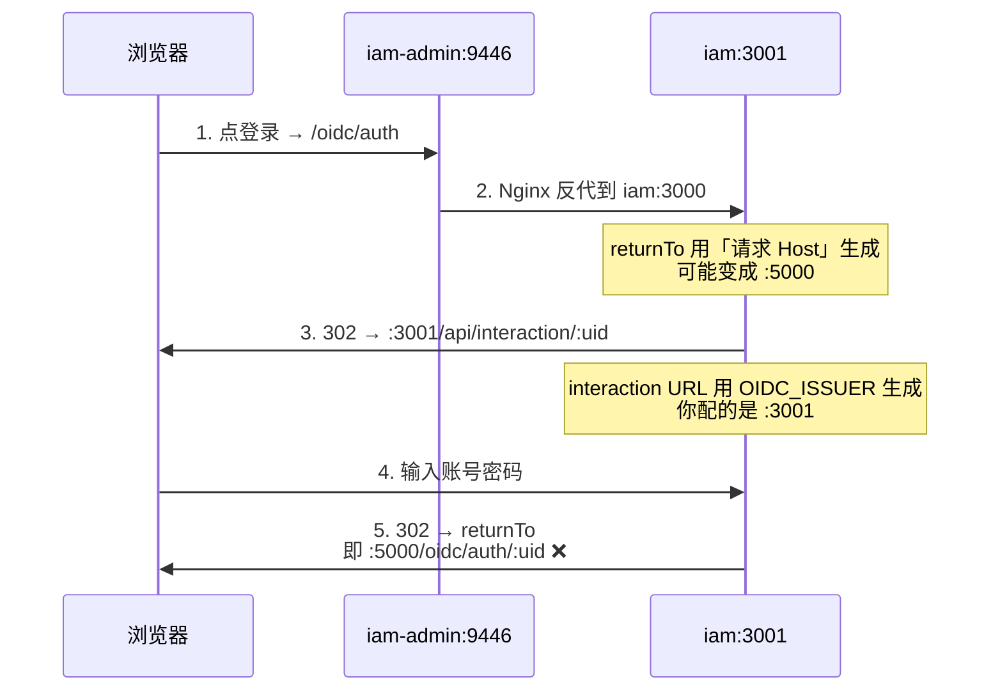

# IAM service OIDC issue
_Exported on 7/12/2026 at 09:43:07 GMT+8 from Cursor (3.8.11)_

---

**User**

我们公司服务架构是NAS（群晖、威联通、绿联等） → Docker → Portainer http://192.168.50.100:9446/ 那么我也顺利的把 先做（IAM）把IAM 相关的服务比如 iam-admin 和 iam  打成镜像 并用Portainer 上传到了 docker 里 也跑通了，但是有个问题，  # iam-compose.yml 业务应用栈
networks:
  app-net:
    external:
      name: infra_app-net  # 关键！完整网络名=栈名_网络名

services:
  # 后端1：iam-platform-iam
  iam:
    image: iam-platform-server:latest
    container_name: iam-platform-iam
    restart: unless-stopped
    networks:
      - app-net
    environment:
      # 同网络直接用容器名访问基础设施
      DB_HOST: mysql8
      DB_PORT: 3306
      DB_USER: root
      DB_PASSWORD: 123456
      REDIS_HOST: redis7
      REDIS_PORT: 6379
      DB_DATABASE: iam
      OIDC_ISSUER: http://192.168.50.100:3001/oidc
      APP_URL: http://192.168.50.100:3001
      BETTER_AUTH_URL: http://192.168.50.100:3001
      OIDC_COOKIE_KEYS: dev-key-1,dev-key-2
      IAM_INTERACTION_UI_DIR: /app/dist/apps/iam/src/assets/interaction
    # 按需暴露端口（内部互通不需要端口，仅本地调试可映射）
    ports:
      - "3001:3000"

  # 前端1：iam-platform-admin
  iam-platform-admin:
    image: iam-platform-admin:latest
    container_name: iam-platform-admin
    restart: unless-stopped
    networks:
      - app-net
    ports:
      - "9446:80"
 这是我配置的，因为3000有其它服务占用，共工基础设施配置  networks:
  app-net:
    driver: bridge

services:
  nginx:
    image: nginx:1.27
    container_name: nginx
    ports:
      - "9445:80"
    volumes:
      - nginx-data:/etc/nginx/conf.d:ro
    extra_hosts:
      - "host.docker.internal:host-gateway"
    restart: unless-stopped
    networks: # 加入公共网桥
      - app-net

  mysql:
    image: mysql:8.4
    container_name: mysql8
    ports:
      - "3306:3306"
    environment:
      MYSQL_ROOT_PASSWORD: 123456
    volumes:
      - mysql-data:/var/lib/mysql
    restart: unless-stopped
    networks:
      - app-net
    command:
      --character-set-server=utf8mb4
      --collation-server=utf8mb4_unicode_ci

  redis:
    image: redis:7.4
    container_name: redis7
    ports:
      - "6379:6379"
    command: redis-server --appendonly yes
    volumes:
      - redis-data:/data
    restart: unless-stopped
    networks: # 加入公共网桥
      - app-net

volumes:
  mysql-data:
  redis-data:
  nginx-data: 有个问题是 我请求9446 http://192.168.50.100:3001/api/interaction/UmPh4a9pf31U1_DPpeSqM  到这里没问题，输入完账号密码 然后 二次跳转就有问题 http://192.168.50.100:5000/oidc/auth/w_jZeW4xh1yw4UGNyISpj  它突然到5000 我就不理解  我把5000手动换成 3001 就能进入系统了

---

**Cursor**

二次跳转落到 5000 端口，多半是 OIDC/应用基础 URL 仍指向开发默认端口。我先在 IAM 项目里查 5000 和 OIDC 相关配置。


这个问题本质是 **OIDC 登录流程里有两套 URL 来源不一致**，再叠加 NAS 常见的 **5000 端口**（群晖 DSM 默认 HTTP 端口），所以二次跳转会跑到 `5000`。

## 原因说明

登录流程大致是这样：



关键代码在这里：

**1. 登录页地址** — 用你配置的 `OIDC_ISSUER`（你设的是 `3001`）：

```164:165:c:\Users\Administrator\Desktop\workspace\iam-platform\apps\iam\src\modules\security\oidc\services\oidc.service.ts
        url: (_ctx: unknown, interaction: { uid: string }) =>
          `${issuerOrigin}/${prefix}/interaction/${interaction.uid}`,
```

**2. 登录完成后的回跳 `returnTo`** — `node-oidc-provider` 用的是 **HTTP 请求里的 Host / X-Forwarded-***，不是 `OIDC_ISSUER`：

```87:96:c:\Users\Administrator\Desktop\workspace\iam-platform\node_modules\oidc-provider\lib\helpers\oidc_context.js
    urlFor(name, opt) {
      const mountPath = (this.ctx.req.originalUrl && this.ctx.req.originalUrl.substring(
        0,
        this.ctx.req.originalUrl.indexOf(this.ctx.request.url),
      ))
        || this.ctx.mountPath // koa-mount
        || this.ctx.req.baseUrl // expressApp.use('/op', provider.callback());
        || ''; // no mount

      return new URL(provider.pathFor(name, { mountPath, ...opt }), this.ctx.href).href;
```

所以你看到的现象是：

| 步骤 | URL | 来源 |
|------|-----|------|
| 登录页 | `192.168.50.100:3001/api/interaction/...` | `OIDC_ISSUER=3001` |
| 登录后回跳 | `192.168.50.100:5000/oidc/auth/...` | 请求 Host / 反代头（NAS 常带 5000） |

手动把 `5000` 改成 `3001` 能进系统，也印证了这一点。

**3. 当前配置还有一处不一致**

- 后端 compose：`OIDC_ISSUER=http://192.168.50.100:3001/oidc`
- 前端 `config.js`（局域网 IP）：`oidcIssuer=http://192.168.50.100:9446/oidc`

前端从 **9446** 发起 OIDC，后端 interaction 却指向 **3001**，returnTo 又可能被 NAS 搞成 **5000**，三处端口全不一样。

---

## 推荐方案：单端口 9446（最省事）

admin 的 Nginx 已经反代了 `/api/` 和 `/oidc/`，**浏览器只访问 9446**，三处 URL 统一即可。

### 1. 改 IAM 容器环境变量（Portainer 里改后重启）

```yaml
OIDC_ISSUER: http://192.168.50.100:9446/oidc
APP_URL: http://192.168.50.100:9446
BETTER_AUTH_URL: http://192.168.50.100:9446
```

**不要**再单独用 `3001` 做 OIDC 入口；`3001` 可以只留给调试，日常登录走 9446。

### 2. 修 admin Nginx 反代头（避免 NAS 把端口搞成 5000）

当前 `admin.conf` 用的是 `Host $host`（**不带端口**）：

```12:15:c:\Users\Administrator\Desktop\workspace\iam-platform\deploy\nginx\admin.conf
        proxy_set_header Host $host;
        proxy_set_header X-Real-IP $remote_addr;
        proxy_set_header X-Forwarded-For $proxy_add_x_forwarded_for;
        proxy_set_header X-Forwarded-Proto $scheme;
```

建议改成（`/api/`、`/oidc/`、`/interaction-assets/` 三处都改）：

```nginx
proxy_set_header Host $http_host;
proxy_set_header X-Forwarded-Host $http_host;
proxy_set_header X-Forwarded-Proto $scheme;
proxy_set_header X-Real-IP $remote_addr;
proxy_set_header X-Forwarded-For $proxy_add_x_forwarded_for;
```

`$http_host` 会保留 `192.168.50.100:9446`，IAM 生成 `returnTo` 时就不会落到 5000。

改完后需 **重新构建并部署** `iam-platform-admin` 镜像。

### 3. 确认 admin 能连到 IAM

`admin.conf` 里 upstream 是 `http://iam:3000`，compose 里服务名必须是 `iam`（你现在是 `iam`，没问题）。若容器名是 `iam-platform-iam` 但服务名不是 `iam`，反代会 502。

### 4. 更新数据库 redirect_uri

在 MySQL 里给 `iam-admin-spa` 加上 9446 回调：

```sql
UPDATE oauth_client
SET redirect_uris = JSON_ARRAY_APPEND(
  redirect_uris, '$', 'http://192.168.50.100:9446/callback.html'
)
WHERE client_id = 'iam-admin-spa';
```

---

## 验证步骤

1. 打开 `http://192.168.50.100:9446/#/login`（不要从 3001 进）
2. 点登录后，地址栏应类似：
   - `http://192.168.50.100:9446/oidc/auth?...`
   - 然后 `http://192.168.50.100:9446/api/interaction/...`
3. 输入账号密码后，应回到：
   - `http://192.168.50.100:9446/oidc/auth/xxxxx`（**不是 5000，也不是 3001**）
4. 最后回到 `http://192.168.50.100:9446/callback.html?code=...`

---

## 备选：坚持用 3001 做 IAM

若一定要 IAM 走 3001：

1. 改 `config.js` 局域网分支，让 `oidcIssuer` 也指向 `3001`
2. 浏览器直接从 `http://192.168.50.100:3001/oidc/auth` 发起登录，**不要**经 9446 反代
3. `redirect_uri` 也要对应改

这样 `returnTo` 和 interaction 都是 3001，但 admin 和 IAM 跨端口，CORS、cookie 会更麻烦，不如单端口 9446。

---

## 小结

| 问题 | 说明 |
|------|------|
| 为什么跳到 5000？ | `returnTo` 用请求 Host 生成；NAS/反代可能带入 5000（群晖 DSM 默认端口） |
| 为什么 interaction 是 3001？ | `OIDC_ISSUER` 配的是 3001 |
| 为什么改 5000→3001 能进？ | 路径对，只是端口错了 |
| 怎么修？ | **三处统一成 9446**：后端 env、前端 config.js（已是 9446）、Nginx 用 `$http_host` |

如果你愿意，我可以直接在仓库里改好 `admin.conf` 和 `portainer.md` 里的示例 compose，你重新打镜像部署就行。

